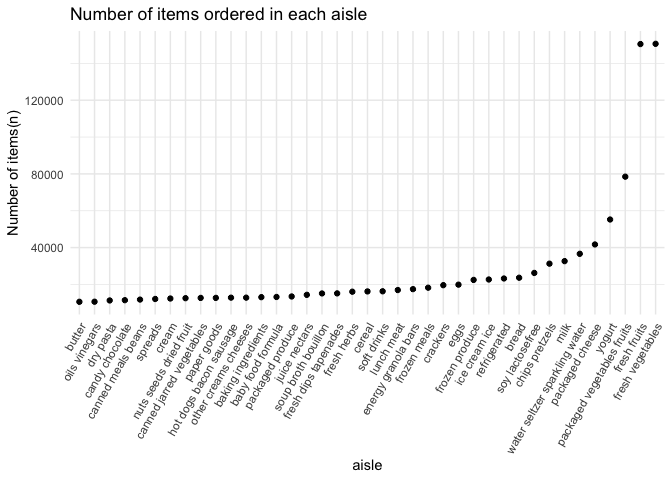

Data Science HW 3
================
Hingling Yu
2023-10-07

## Problem 0

- Set up, with R code hided

## Problem 1

#### Read dataset

``` r
data("instacart")

instacart = 
  instacart |> 
  as_tibble()
```

#### Answer the questions

- The `instacart` dataset contains 1384617 of rows, and each row
  representing a single product from an instacart order. Also contains
  15columns, which are variables include identifiers for user, order,
  and product; the order in which each product was added to the cart.
  There are several order-level variables, describing the day and time
  of the order, and number of days since prior order. Then there are
  several item-specific variables, describing the product name
  (e.g. Yogurt, Avocado), department (e.g. dairy and eggs, produce), and
  aisle (e.g. yogurt, fresh fruits), and whether the item has been
  ordered by this user in the past.

- In total, there are 39123 products found in 131209 orders from 131209
  distinct users.

``` r
instacart |>
  count(aisle) |> # How many aisles
  arrange(desc(n)) # See what aisles are the most items order from so descending
```

    ## # A tibble: 134 × 2
    ##    aisle                              n
    ##    <chr>                          <int>
    ##  1 fresh vegetables              150609
    ##  2 fresh fruits                  150473
    ##  3 packaged vegetables fruits     78493
    ##  4 yogurt                         55240
    ##  5 packaged cheese                41699
    ##  6 water seltzer sparkling water  36617
    ##  7 milk                           32644
    ##  8 chips pretzels                 31269
    ##  9 soy lactosefree                26240
    ## 10 bread                          23635
    ## # ℹ 124 more rows

- According to the table above, there are 134 aisles in total, and fresh
  vegetables and fresh fruits are the most items ordered from.

#### Make a plot that shows the number of items ordered in each aisle

``` r
instacart|> 
  count(aisle) |> # count the number of items order in each aisles
  filter(n > 10000) |> # Want aisles with more than 10000 items ordered
  mutate(aisle = fct_reorder(aisle, n)) |> # order aisles by the number of items order
  ggplot(aes(x = aisle, y = n)) +
  geom_point() +
  labs(
    title = "Number of items ordered in each aisle", # Give a title to the plot
    y = "Number of items(n)") + # Give the y-axis a easier understand label
  theme(axis.text.x = element_text(angle = 60, hjust = 1)) # Twist the angle of text in the x-axis for easier reading
```



#### Table of three most popular items in selected aisles

``` r
instacart |>
  filter(aisle %in% c("baking ingredients", "dog food care", "packaged vegetables fruits")) |>
  group_by(aisle) |>
  count(product_name) |>
  mutate(rank = min_rank(desc(n))) |># rank by descending so we can easily get the top 3 popular products in each of the aisle we want
  filter(rank < 4) |> # filter the top 3 popular items
  arrange(desc(n)) |> # arrange with the most number of items ordered first
  rename(number_of_times_ordered = n)|> # rename n to number_of_times_ordered
  select(-rank)|> #remove variable rank
  knitr::kable()
```

| aisle                      | product_name                                  | number_of_times_ordered |
|:---------------------------|:----------------------------------------------|------------------------:|
| packaged vegetables fruits | Organic Baby Spinach                          |                    9784 |
| packaged vegetables fruits | Organic Raspberries                           |                    5546 |
| packaged vegetables fruits | Organic Blueberries                           |                    4966 |
| baking ingredients         | Light Brown Sugar                             |                     499 |
| baking ingredients         | Pure Baking Soda                              |                     387 |
| baking ingredients         | Cane Sugar                                    |                     336 |
| dog food care              | Snack Sticks Chicken & Rice Recipe Dog Treats |                      30 |
| dog food care              | Organix Chicken & Brown Rice Recipe           |                      28 |
| dog food care              | Small Dog Biscuits                            |                      26 |

#### Table of the mean hour of the day at which Pink Lady Apples and Coffee Ice Cream are ordered on each day of the week

``` r
instacart |>
  filter(product_name %in% c("Pink Lady Apples", "Coffee Ice Cream")) |>
  group_by(product_name, order_dow) |>
  summarize(mean_hour = mean(order_hour_of_day)) |>
  pivot_wider(
    names_from = order_dow,
    values_from = mean_hour
  ) |>
  knitr::kable(digits = 2)
```

    ## `summarise()` has grouped output by 'product_name'. You can override using the
    ## `.groups` argument.

| product_name     |     0 |     1 |     2 |     3 |     4 |     5 |     6 |
|:-----------------|------:|------:|------:|------:|------:|------:|------:|
| Coffee Ice Cream | 13.77 | 14.32 | 15.38 | 15.32 | 15.22 | 12.26 | 13.83 |
| Pink Lady Apples | 13.44 | 11.36 | 11.70 | 14.25 | 11.55 | 12.78 | 11.94 |

## Problem 2

#### Read dataset

``` r
library(p8105.datasets)
data("brfss_smart2010")

brfss_smart2010 = 
  brfss_smart2010 |>
  tibble()
```

#### Clean data `brfss_smart2010`

``` r
clean_brfss_smart2010 =
  brfss_smart2010 |>
  janitor::clean_names() |>
  filter(
    topic == "Overall Health", 
    response %in% c("Excellent", "Very good", "Good", "Fair", "Poor")) |>
  mutate(response = factor(response, levels = c("Poor", "Fair", "Good", "Very good", "Excellent"), 
                           ordered = TRUE)) 
```
