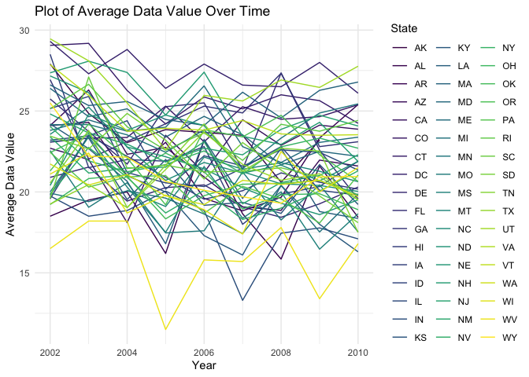
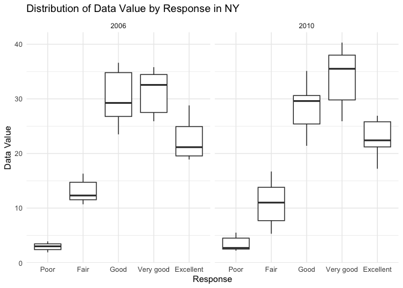
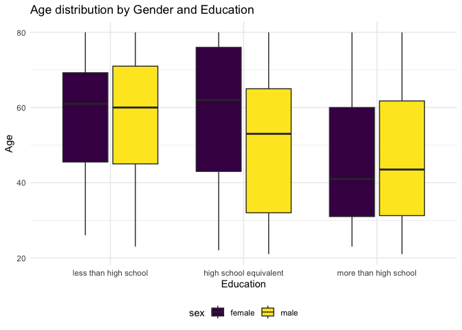
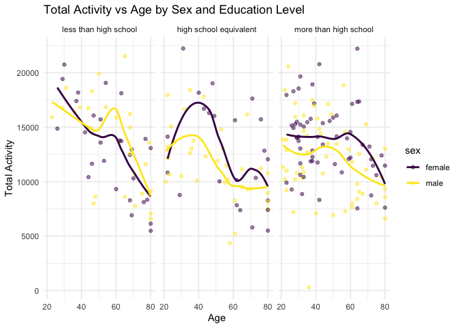
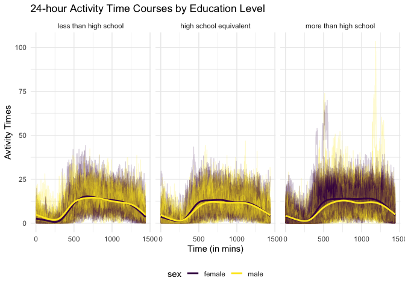

Data Science HW 3
================
Hingling Yu
2023-10-07

## Problem 0

- Set up, with R code hided

## Problem 1

#### Read dataset

``` r
data("instacart")

instacart = 
  instacart |> 
  as_tibble()
```

### Answer the questions

- The `instacart` dataset contains 1384617 of rows, and each row
  representing a single product from an instacart order. Also contains
  15columns, which are variables include identifiers for user, order,
  and product; the order in which each product was added to the cart.
  There are several order-level variables, describing the day and time
  of the order, and number of days since prior order. Then there are
  several item-specific variables, describing the product name
  (e.g. Yogurt, Avocado), department (e.g. dairy and eggs, produce), and
  aisle (e.g. yogurt, fresh fruits), and whether the item has been
  ordered by this user in the past.

- In total, there are 39123 products found in 131209 orders from 131209
  distinct users.

``` r
instacart |>
  count(aisle) |> # How many aisles
  arrange(desc(n)) # See what aisles are the most items order from so descending
```

    ## # A tibble: 134 × 2
    ##    aisle                              n
    ##    <chr>                          <int>
    ##  1 fresh vegetables              150609
    ##  2 fresh fruits                  150473
    ##  3 packaged vegetables fruits     78493
    ##  4 yogurt                         55240
    ##  5 packaged cheese                41699
    ##  6 water seltzer sparkling water  36617
    ##  7 milk                           32644
    ##  8 chips pretzels                 31269
    ##  9 soy lactosefree                26240
    ## 10 bread                          23635
    ## # ℹ 124 more rows

- According to the datas above, there are 134 aisles in total, and fresh
  vegetables and fresh fruits are the most items ordered from.

#### Make a plot that shows the number of items ordered in each aisle

``` r
instacart|> 
  count(aisle) |> # count the number of items order in each aisles
  filter(n > 10000) |> # Want aisles with more than 10000 items ordered
  mutate(aisle = fct_reorder(aisle, n)) |> # order aisles by the number of items order
  ggplot(aes(x = aisle, y = n)) +
  geom_point() +
  labs(
    title = "Number of items ordered in each aisle", # Give a title to the plot
    y = "Number of items(n)") + # Give the y-axis a easier understand label
  theme(axis.text.x = element_text(angle = 60, hjust = 1)) # Twist the angle of text in the x-axis for easier reading
```

<!-- -->

#### Table of three most popular items in selected aisles

``` r
instacart |>
  filter(aisle %in% c("baking ingredients", "dog food care", "packaged vegetables fruits")) |>
  group_by(aisle) |>
  count(product_name) |>
  mutate(rank = min_rank(desc(n))) |># rank by descending so we can easily get the top 3 popular products in each of the aisle we want
  filter(rank < 4) |> # filter the top 3 popular items
  arrange(desc(n)) |> # arrange with the most number of items ordered first
  rename(number_of_times_ordered = n)|> # rename n to number_of_times_ordered
  select(-rank)|> #remove variable rank
  knitr::kable()
```

| aisle                      | product_name                                  | number_of_times_ordered |
|:---------------------------|:----------------------------------------------|------------------------:|
| packaged vegetables fruits | Organic Baby Spinach                          |                    9784 |
| packaged vegetables fruits | Organic Raspberries                           |                    5546 |
| packaged vegetables fruits | Organic Blueberries                           |                    4966 |
| baking ingredients         | Light Brown Sugar                             |                     499 |
| baking ingredients         | Pure Baking Soda                              |                     387 |
| baking ingredients         | Cane Sugar                                    |                     336 |
| dog food care              | Snack Sticks Chicken & Rice Recipe Dog Treats |                      30 |
| dog food care              | Organix Chicken & Brown Rice Recipe           |                      28 |
| dog food care              | Small Dog Biscuits                            |                      26 |

#### Table of the mean hour of the day at which Pink Lady Apples and Coffee Ice Cream are ordered on each day of the week

``` r
instacart |>
  filter(product_name %in% c("Pink Lady Apples", "Coffee Ice Cream")) |>
  group_by(product_name, order_dow) |>
  summarize(mean_hour = mean(order_hour_of_day)) |>
  pivot_wider(
    names_from = order_dow,
    values_from = mean_hour
  ) |>
  knitr::kable(digits = 2)
```

    ## `summarise()` has grouped output by 'product_name'. You can override using the
    ## `.groups` argument.

| product_name     |     0 |     1 |     2 |     3 |     4 |     5 |     6 |
|:-----------------|------:|------:|------:|------:|------:|------:|------:|
| Coffee Ice Cream | 13.77 | 14.32 | 15.38 | 15.32 | 15.22 | 12.26 | 13.83 |
| Pink Lady Apples | 13.44 | 11.36 | 11.70 | 14.25 | 11.55 | 12.78 | 11.94 |

## Problem 2

#### Read dataset

``` r
library(p8105.datasets)
data("brfss_smart2010")

brfss_smart2010 = 
  brfss_smart2010 |>
  tibble()
```

#### Clean data `brfss_smart2010`

``` r
clean_brfss_smart2010 =
  brfss_smart2010 |>
  janitor::clean_names() |>
  filter(
    topic == "Overall Health", 
    response %in% c("Poor", "Fair", "Good", "Very good", "Excellent")) |>
  mutate(
    response = as.factor(response),
    response = fct_relevel(
      response, "Poor", "Fair", "Good", "Very good", "Excellent")) 
```

### Answer the questions

#### States were observed at 7 or more locations in 2002 and 2010

``` r
# states were observed at 7 or more locations in 2002 and 2010
clean_brfss_smart2010 |>
  filter(year %in% c(2002,2010)) |>
  group_by(year, locationabbr)|>
  summarize(num_locations = n_distinct(locationdesc)) |>
  filter(num_locations >= 7)
```

    ## `summarise()` has grouped output by 'year'. You can override using the
    ## `.groups` argument.

    ## # A tibble: 20 × 3
    ## # Groups:   year [2]
    ##     year locationabbr num_locations
    ##    <int> <chr>                <int>
    ##  1  2002 CT                       7
    ##  2  2002 FL                       7
    ##  3  2002 MA                       8
    ##  4  2002 NC                       7
    ##  5  2002 NJ                       8
    ##  6  2002 PA                      10
    ##  7  2010 CA                      12
    ##  8  2010 CO                       7
    ##  9  2010 FL                      41
    ## 10  2010 MA                       9
    ## 11  2010 MD                      12
    ## 12  2010 NC                      12
    ## 13  2010 NE                      10
    ## 14  2010 NJ                      19
    ## 15  2010 NY                       9
    ## 16  2010 OH                       8
    ## 17  2010 PA                       7
    ## 18  2010 SC                       7
    ## 19  2010 TX                      16
    ## 20  2010 WA                      10

- Based on the datas above, in 2002, Connecticut, Florida,
  Massachusetts, North Carolina, and Pennsylvania observed more than 7
  locations. And in 2010, California, Colorado, Florida, Massachusetts,
  Maryland, North Carolina, Nebraska, New Jersey, New York, Ohio,
  Pennsylvania, South Carolina, Texas, and Washington observed more than
  7 locations.

#### “spaghetti” plot of average `data_value` over time within a state

``` r
# Limit to excellent responses, and contains year, state and average data_value cross locations
excellent_brfss = 
  clean_brfss_smart2010 |>
  filter(response == "Excellent") |>
  group_by(year, locationabbr) |>
  summarize(avg_data_value = mean(data_value, na.rm = TRUE))
```

    ## `summarise()` has grouped output by 'year'. You can override using the
    ## `.groups` argument.

``` r
# Plot of average `data_value` over time within a state
excellent_brfss |>
  ggplot(aes(x = year, y = avg_data_value, group = locationabbr, color = locationabbr)) +
  geom_line() +
  labs(title = "Plot of Average Data Value Over Time",
       x = "Year",
       y = "Average Data Value",
       color = "State") +
  theme(legend.position = "right") +
  viridis::scale_color_viridis(
    discrete = TRUE
  )
```

<!-- -->

#### Two-panel plot for the years 2006 and 2010, distribution of `data_value` for responses (“Poor” to “Excellent”) among locations in NY State.

``` r
brfss_ny_2006_2010 = 
  clean_brfss_smart2010 |>
  filter(locationabbr == "NY",
         year %in% c(2006,2010))

brfss_ny_2006_2010 |>
  ggplot(aes(x = response, y = data_value)) +
  geom_boxplot() +
  facet_grid(. ~ year) +
  labs(title = "Distribution of Data Value by Response in NY",
       x = "Response",
       y = "Data Value") 
```

<!-- -->

## Problem 3

#### Clean the `nhanes_accel` dataset

``` r
clean_nhanes_accel = 
  read_csv("data/nhanes_accel.csv") |>
  janitor::clean_names() |>
  pivot_longer(                                            
    min1:min1440,
    names_to = "min",
    values_to = "mims",
    names_prefix = "min"
  ) |>
  mutate(
    min = as.numeric(min)
  )
```

    ## Rows: 250 Columns: 1441
    ## ── Column specification ────────────────────────────────────────────────────────
    ## Delimiter: ","
    ## dbl (1441): SEQN, min1, min2, min3, min4, min5, min6, min7, min8, min9, min1...
    ## 
    ## ℹ Use `spec()` to retrieve the full column specification for this data.
    ## ℹ Specify the column types or set `show_col_types = FALSE` to quiet this message.

#### Clean the `nhanes_covar` dataset

``` r
clean_nhanes_covar =
  read_csv("data/nhanes_covar.csv", skip = 4) |>
  janitor::clean_names() |>
  filter(age >= 21) |>
  drop_na() |>
  mutate(
    sex = ifelse(sex == 1, "male", "female"),
    education = case_when(
      education == 1 ~ "less than high school",
      education == 2 ~ "high school equivalent",
      education == 3 ~ "more than high school"),
    education = fct_relevel(education, "less than high school", "high school equivalent", "more than high school")
  )
```

    ## Rows: 250 Columns: 5
    ## ── Column specification ────────────────────────────────────────────────────────
    ## Delimiter: ","
    ## dbl (5): SEQN, sex, age, BMI, education
    ## 
    ## ℹ Use `spec()` to retrieve the full column specification for this data.
    ## ℹ Specify the column types or set `show_col_types = FALSE` to quiet this message.

#### Combine `nhanes_covar` and `nhanes_accel` datasets

``` r
merged_nhanes = 
  left_join(clean_nhanes_covar, clean_nhanes_accel, by = "seqn")
```

#### Table for the number of men and women in each education category

``` r
merged_nhanes|>
  group_by(sex, education) |>
  distinct(seqn) |>
  summarize(count = n()) |>
  knitr::kable()
```

    ## `summarise()` has grouped output by 'sex'. You can override using the `.groups`
    ## argument.

| sex    | education              | count |
|:-------|:-----------------------|------:|
| female | less than high school  |    28 |
| female | high school equivalent |    23 |
| female | more than high school  |    59 |
| male   | less than high school  |    27 |
| male   | high school equivalent |    35 |
| male   | more than high school  |    56 |

#### Plot of age distribution by gender and education

``` r
merged_nhanes|>
  ggplot(aes(x = education, y = age, fill = sex)) +
  geom_boxplot() + 
  labs(title = "Age distribution by Gender and Education", 
       y = "Age", 
       x = "Education") 
```

<!-- -->

``` r
str(merged_nhanes)
```

    ## tibble [328,320 × 7] (S3: tbl_df/tbl/data.frame)
    ##  $ seqn     : num [1:328320] 62161 62161 62161 62161 62161 ...
    ##  $ sex      : chr [1:328320] "male" "male" "male" "male" ...
    ##  $ age      : num [1:328320] 22 22 22 22 22 22 22 22 22 22 ...
    ##  $ bmi      : num [1:328320] 23.3 23.3 23.3 23.3 23.3 23.3 23.3 23.3 23.3 23.3 ...
    ##  $ education: Factor w/ 3 levels "less than high school",..: 2 2 2 2 2 2 2 2 2 2 ...
    ##  $ min      : num [1:328320] 1 2 3 4 5 6 7 8 9 10 ...
    ##  $ mims     : num [1:328320] 1.106 3.115 1.468 0.938 1.599 ...

- Within the “less than high school” level, females have a slightly
  higher median age than males. In the “high school equivalent” level,
  the median age for females is higher compared to males. For those with
  “more than high school” education, the median ages of males and
  females are close around the age of 40s.The median age tends to
  decrease with higher education for both genders. Also, both males and
  females exhibit similar age distributions across the different
  education levels. Across all education levels, the age range of males
  and females exhibits considerable overlap, but the interquartile range
  for males appears broader, especially in the “high school equivalent”
  level.

#### Plot of total activities vs age by sex and education level

``` r
# Aggregate activity by sequence number

total_activity_nhanes =
  merged_nhanes |>
  group_by(seqn, sex, age, education) |>
  summarize(
    total_activity = sum(mims)
    )
```

    ## `summarise()` has grouped output by 'seqn', 'sex', 'age'. You can override
    ## using the `.groups` argument.

``` r
total_activity_nhanes |>
  ggplot(aes(x = age, y = total_activity, color = sex)) +
  geom_point(alpha = 0.5) +
  geom_smooth(se = FALSE) + 
  facet_grid(. ~ education) +
  labs(title = "Total Activity vs Age by Sex and Education Level", 
       x = "Age", 
       y = "Total Activity") +
  theme_minimal()
```

    ## `geom_smooth()` using method = 'loess' and formula = 'y ~ x'

<!-- -->

- According to the plot, total activity tends to decrease with age. It
  is noticeable across all education levels, where younger individuals
  generally have higher total activity compared to their older
  counterparts. The decline is particularly sharp after the age of 60,
  suggesting a significant reduction in physical activity as people
  approach later stages of life.

- There are noticeable differences between men and women. In the “less
  than high school” education level, males have higher activity level
  than females between the age 40 to 80. In both “high school
  equivalent” and “more than high school” education level, females
  appear to have higher total activity than males, especially in the age
  range of 20 to 60. Interestingly, the female’s total activity level
  increase again for a little bit between the age 60 to 70 in the “high
  school equivalent” education level. Among those with “more than high
  school” education, the activity levels drop significantly only after
  the age of 60, and the differences between male and female activity
  levels seem less consistent, especially in the age range of 40 to 60.

#### Plot of 24-hour activity time courses by education level

``` r
merged_nhanes |>
  ggplot(aes(x = min, y = mims, group = seqn, color = sex)) +
  geom_line(alpha = .2) +
  geom_smooth(aes(group = sex), se = FALSE) +
  facet_grid(. ~ education) +
  labs(
    title = "24-hour Activity Time Courses by Education Level",
    x = "Time (in mins)",
    y = "Avtivity Times",
  ) 
```

    ## `geom_smooth()` using method = 'gam' and formula = 'y ~ s(x, bs = "cs")'

<!-- -->

- According to the plot, a peak of activity is observed around 750 mins
  across all education levels. This suggests participants are most
  active during midday or early afternoon. Additionally, activity levels
  are low during the early and late hours, aligning with typical
  sleeping times.

- For both “less than high school” and “high school equivalent”
  education levels, males and females exhibit similar activity patterns
  throughout the day. However, in the “more than high school” category,
  females are slightly more active than males between morning to noon
  time, while males surpass females in activity around dinner time.
